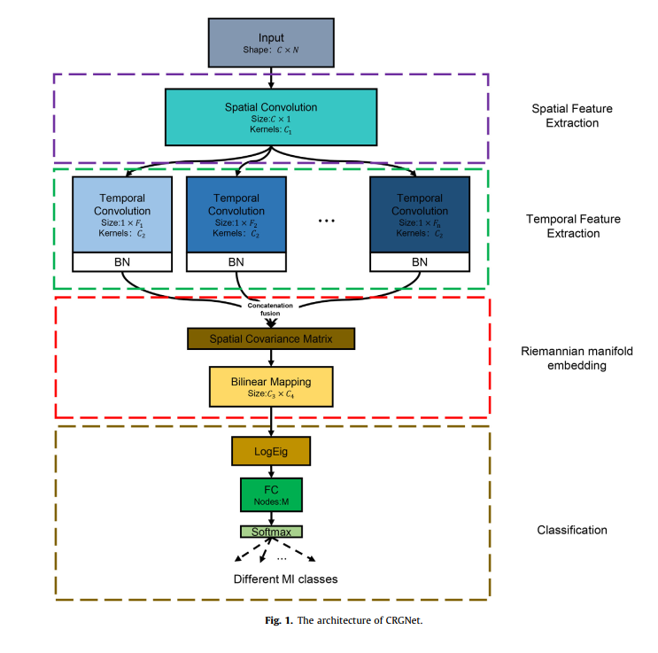
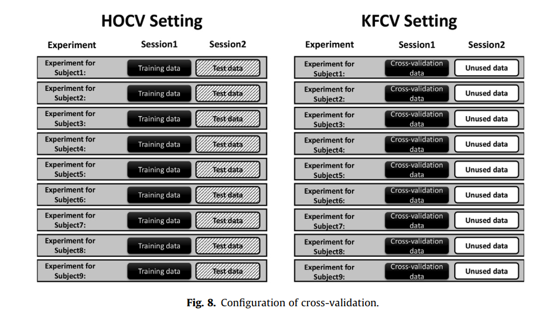
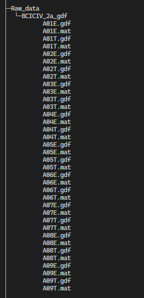
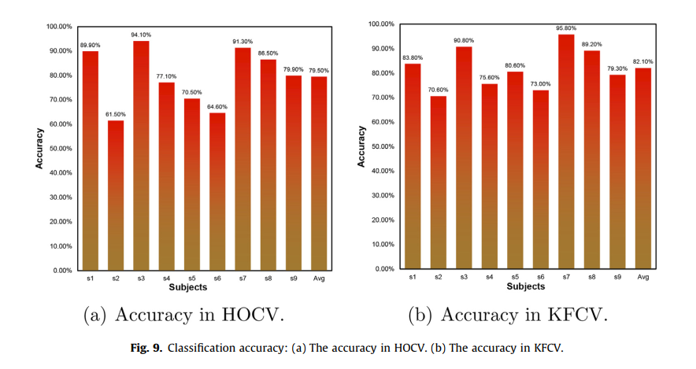

# CRGNet：implementation of CRGNet in pytorch
Convolutional neural network and riemannian geometry hybrid approach for motor imagery classification

## Introduction


The electroencephalogram (EEG) signal is commonly applied in the brain-computer interface (BCI) system of the motor imagery paradigm because it is noninvasive and has a high time resolution. This paper proposes a motor imagery classification method based on convolutional neural networks and Riemannian geometry to overcome the problem of noise and extreme values impacting motor imagery classification performance. The time-domain properties of EEG signals are extracted using multiscale temporal convolutions, whereas the spatial aspects of EEG signals are extracted using multiple convolutional kernels learned by spatial convolution. The extracted features are mapped to a Riemannian manifold space, and bilinear mapping and logarithmic operations are performed on the features to solve the problem of noise and extreme values. The effectiveness of the proposed method is validated using four types of motor imagery in the BCI competition IV dataset 2a to evaluate the classification ability. The experimental results show that the proposed approach has obvious advantages in the classification performance of motor imagery.

## Trainning setting

Two different cross-validation forms are utilized for the performance evaluation, hold-out cross-validation (HOCV) and k-fold cross-validation (KFCV). HOCV and KFCV are designed for subject-special experiments. As illustrated in Fig.8, HOCV utilized the samples from the first session as the training set and those of the second session as the test set, and KFCV used the samples from the first session for both training and testing.

## Requirements

1. python 3.8+
2. Pytorch 
3. mne 
4. numpy
5. sklearn
6. scipy

## Dataset
We evaluated our model using [BCI Competition Dataset IV 2a](https://www.bbci.de/competition/iv/results/).
Before running the code, you need to download the raw data, and unzip it to the ./Raw_data folder, like this:



## Instructions
1.Process the raw data.
```
cd ./Data_process
python process_function.py
```
2.Train
```
cd ./Classifier
python HOCV.py
python KFCV.py
```

## Result


## Citation
If you find it useful, please cite our paper as follows:
```
@article{gao2022convolutional,
  title={Convolutional neural network and riemannian geometry hybrid approach for motor imagery classification},
  author={Gao, Chang and Liu, Wenchao and Yang, Xian},
  journal={Neurocomputing},
  volume={507},
  pages={180--190},
  year={2022},
  publisher={Elsevier}
}
```
## Notes
+ The operatoins of QR and SVD make the reasults different from different devices,even if fix the random seed. 
+ This code does not yet support GPU acceleration and it is recommended to train the model on CPU.

## Acknowledgements
+ The Biliner mapping and LogEig layer are derived from SPDNet. Thanks to the authors of the paper 'A Riemannian Network for SPD Matrix Learning'.
+ Thanks to Alireza Davoudi for the [Python implementation of SPDNet](https://github.com/adavoudi/spdnet).